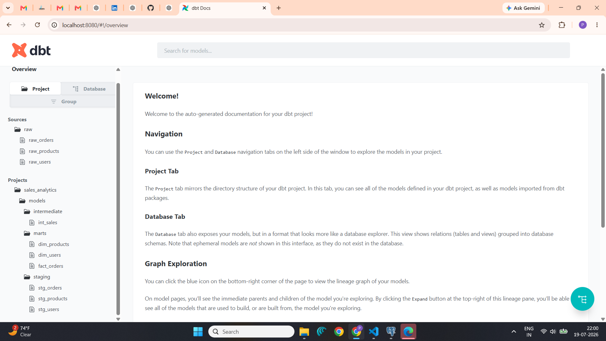
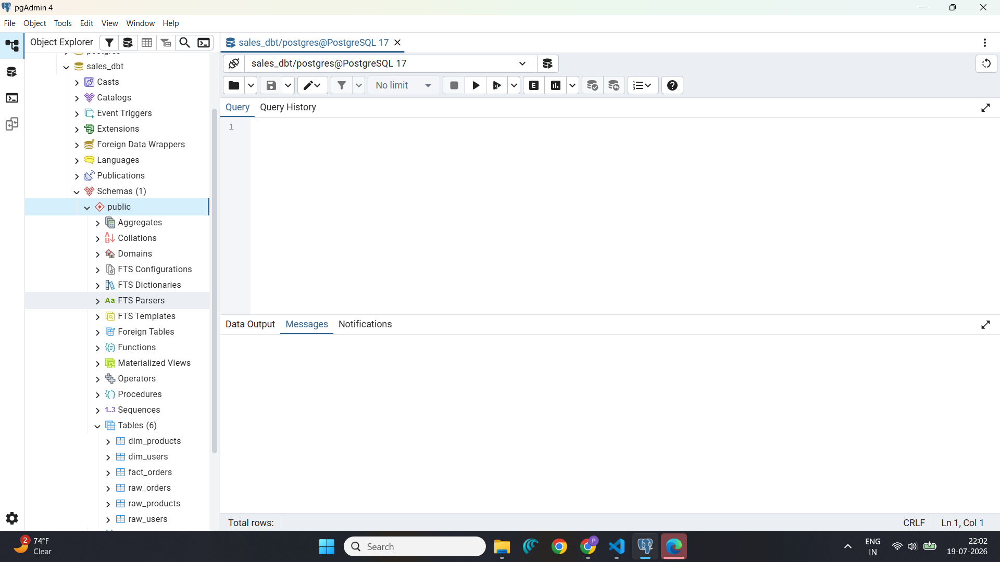

# 🚀 Project 6 - End-to-End dbt API Sales Analytics Pipeline

## 📌 Project Overview

This project demonstrates an end-to-end modern Data Engineering pipeline using **Python**, **PostgreSQL**, and **dbt**.

The pipeline extracts sales data from a public REST API, loads it into PostgreSQL as raw tables, transforms the data using dbt into analytics-ready models, performs data quality testing, and generates interactive documentation with lineage graphs.

---

# 🏗️ Architecture

```
DummyJSON REST API
        │
        ▼
 Python ETL Loader
        │
        ▼
 PostgreSQL
 (Raw Tables)
        │
        ▼
      dbt
─────────────────────────
 Staging Models
        │
 Intermediate Model
        │
 Mart Models
(Dimensions & Facts)
        │
        ▼
 Data Quality Tests
        │
        ▼
 dbt Documentation
 & Lineage Graph
```

---

# ⚙️ Tech Stack

- Python
- PostgreSQL
- SQLAlchemy
- Pandas
- dbt Core
- dbt-postgres
- REST API (DummyJSON)
- Git
- GitHub

---

# 📂 Project Structure

```
DE-Project-06-dbt-API-Sales-Analytics-Pipeline
│
├── loader
│   ├── extract.py
│   ├── load.py
│   └── main.py
│
├── dbt_project
│   └── sales_analytics
│       ├── models
│       │   ├── staging
│       │   ├── intermediate
│       │   └── marts
│       ├── macros
│       ├── tests
│       ├── snapshots
│       ├── analyses
│       └── dbt_project.yml
│
├── screenshots
│
├── requirements.txt
│
├── README.md
│
└── .gitignore
```

---

# 🔄 Pipeline Workflow

## Step 1

Extract data from DummyJSON REST APIs

- Users API
- Products API
- Carts API

---

## Step 2

Load raw data into PostgreSQL

Created tables

- raw_users
- raw_products
- raw_orders

---

## Step 3

Transform using dbt

### Staging Layer

- stg_users
- stg_products
- stg_orders

---

### Intermediate Layer

- int_sales

---

### Mart Layer

Dimension Tables

- dim_users
- dim_products

Fact Table

- fact_orders

---

# ✅ Data Quality Tests

Implemented dbt tests

- Unique user_id
- Not Null user_id

Executed using

```bash
dbt test
```

---

# 📖 dbt Documentation

Generated project documentation using

```bash
dbt docs generate
dbt docs serve
```

Features

- Interactive documentation
- Column metadata
- Model dependencies
- Lineage Graph

---

# 📊 Data Lineage

The lineage graph shows the complete flow of data.

```
Raw Tables
      │
      ▼
 Staging Models
      │
      ▼
 Intermediate Model
      │
      ▼
 Mart Models
```

---

# 📷 Screenshots

## Lineage Graph


---

## dbt Documentation



---

## dbt Tests


---

## PostgreSQL Tables



---

# ▶️ How to Run

## Install dependencies

```bash
pip install -r requirements.txt
```

---

## Run Python Loader

```bash
python loader/main.py
```

---

## Verify dbt Connection

```bash
dbt debug
```

---

## Execute Models

```bash
dbt run
```

---

## Run Data Tests

```bash
dbt test
```

---

## Generate Documentation

```bash
dbt docs generate
dbt docs serve
```

---

# 📈 Results

✔ Extracted data from REST APIs

✔ Loaded raw data into PostgreSQL

✔ Built staging models

✔ Created intermediate transformations

✔ Built Star Schema

✔ Performed data quality testing

✔ Generated interactive documentation

✔ Visualized end-to-end lineage

---

# 🚀 Future Enhancements

- Schedule using Apache Airflow
- Containerize with Docker
- Deploy on AWS
- CI/CD using GitHub Actions
- Incremental dbt models
- dbt Snapshots
- dbt Source Freshness Monitoring

---

# 👨‍💻 Author

**Pavan Teja**

Data Engineer

GitHub:
https://github.com/VenomPavan
